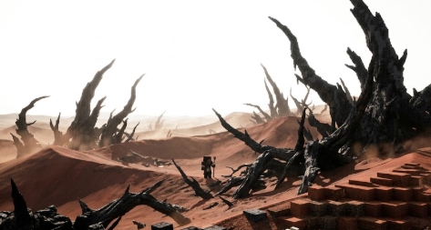

# Алькор: Ознакомительная версия

_\*В данный раздел могут быть внесены изменения и/или дополнения._

## Вселенная Алькор

### Предыстория

Когда-то вселенная Алькор была едина и процветающей, во всей красе своего понимания… Пока не случился Великий Взрыв (_некоторые выжившие ныне именуют Коллапсом_). Колоссальный выброс магической энергии, в результате столкновения двух совершенно разных по своей природе сил: Первозданная магия и Магия Кхара. Разорвал материю и нанес непоправимый вред реальности, навсегда изменив облик Алькора. Мир был расколот на Осколки, что ныне разделяет Пустота, а на месте взрыва образовался Разлом Пустоты, по сей день извергающий огромные всплески нестабильной, извращенной магической энергии и именуемая - Оком Алькора.

### **Осколок Даркнесс**

_(ванильный мир/выживание)_

Единственный временно стабильный Осколок, чудом сохранившийся после Коллапса. Здесь законы природы еще напоминают прежний, цветущий Алькор: растут деревья, течет вода. Это колыбель для Эха Древней Души. Однако покой - лишь иллюзия. Активное выживание, добыча ресурсов и строительство повышают концентрацию магии в этом мире. Этот резонанс неизбежно привлечет внимание слепого Ока Алькора, после чего Даркнесс обречен попасть под его выжигающий взор.

Размер: Колоссальный.

### **Осколок Вэлирилд**

_(подземелье вечной мерзлоты)_

Огромный кусок континента, скованный абсолютным холодом Пустоты. Око Алькора не обращено на него, так как на этом Осколке нет достаточной концентрации магии, чтобы привлечь его смертоносный взор. Оставшись без всякого источника тепла, поверхность Вэлирилда вымерла, поэтому выживание и поиск артефактов Кхара проходят глубоко под землей, в древних шахтах и сетях промерзших подземелий. Бури Квантанта здесь проявляются как замораживающие сквозняки.

Размер: Большой.

### **Осколок Солринджен**

(_иссушающая мертвая пустыня_)

<figure><figcaption></figcaption></figure>

Безжалостная, безжизненная пустыня. Главный противник здесь не флора или фауна в своем виде, а само светило, поскольку оно очень близко и пустыня сама по себе концентрирует в себе магию Кхара. Нахождение на свету, под взором Ока Алькора, палящим светилом и уничтожающим все живое, крайне смертельно. Вода или то, что на неё очень сильно похоже, ценнейший ресурс на этом Осколке. Для выживания используются разные изощрённые способы выживания. А некоторые способные, обнаружившие кристаллы Кхара и их осколки и почувствовавшие в себе магию потомков, нашли способ с их помощью возводить укрытия на самой поверхности.

Размер: Огромный.
