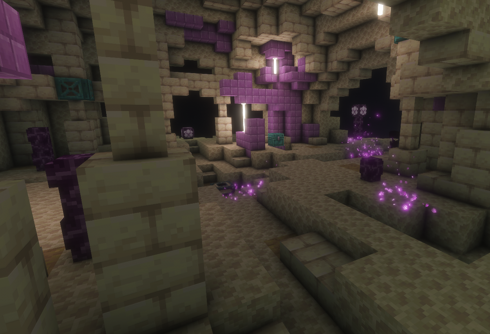
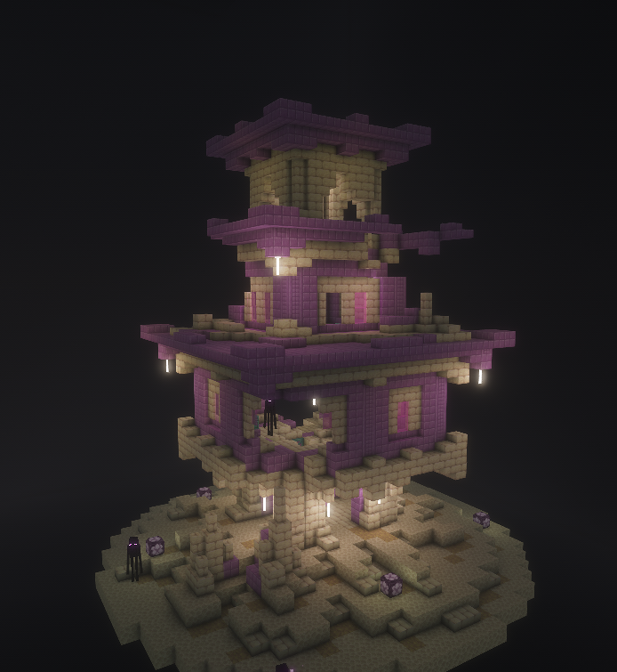
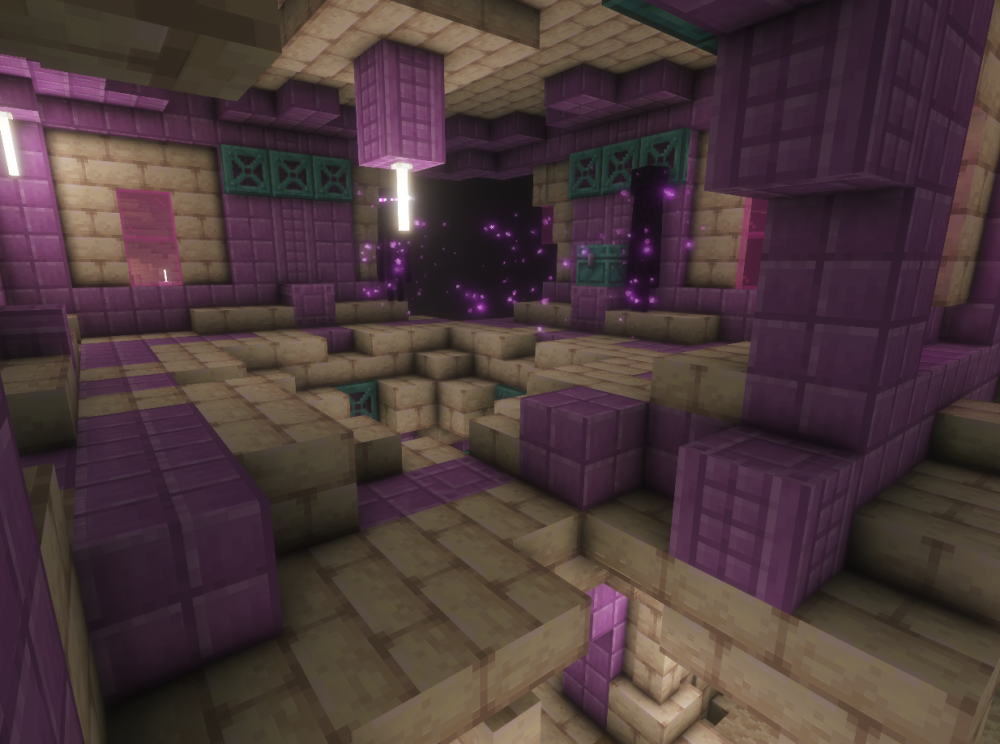

# Край. Структуры


_\*В данный раздел могут быть внесены изменения и/или дополнения._


### Структура №1. Лаборатория

<figure><figcaption></figcaption></figure>

### Структура №2. Башня наблюдателя

<figure><figcaption></figcaption></figure>

<figure><figcaption></figcaption></figure>

### Структура №3. Руины

<em>...здесь должно было быть фото...</em>

