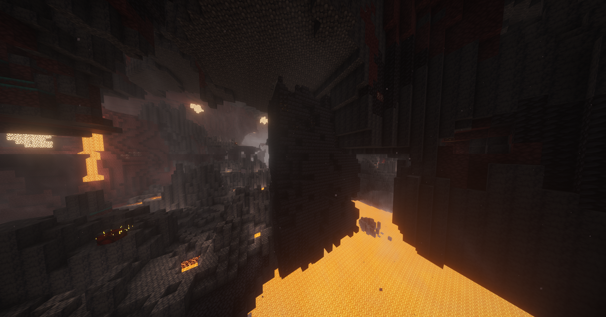
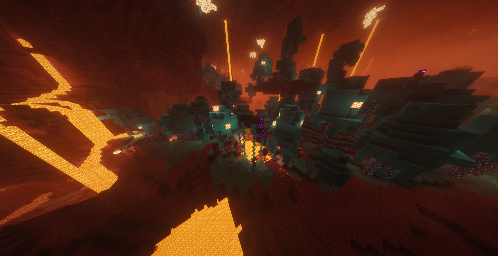
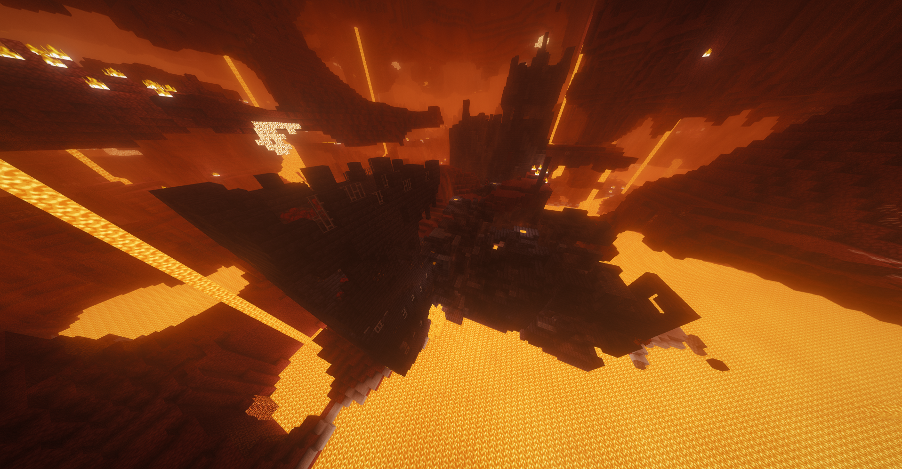
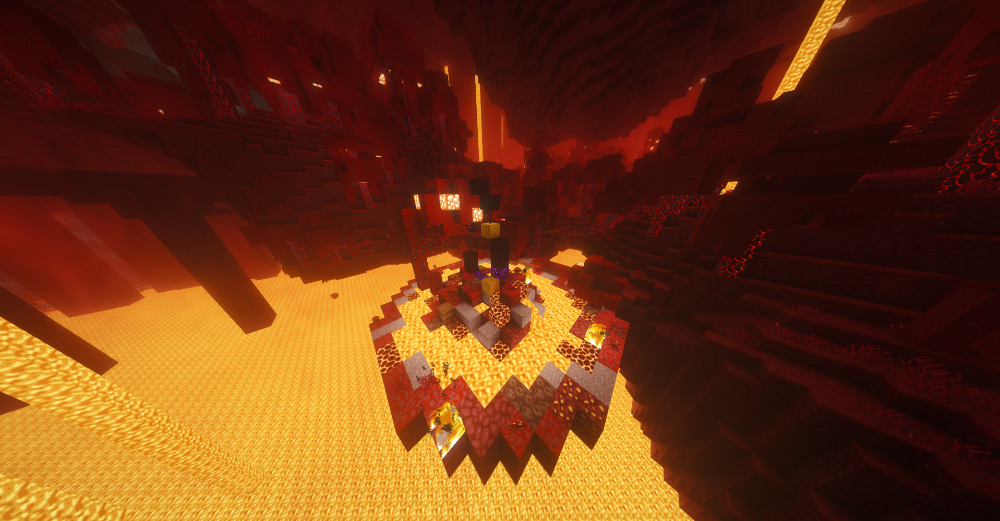

# Преисподняя. Структуры


_\*В данный раздел могут быть внесены изменения и/или дополнения._


### Структура №1. Малый бастион (v1)

<figure><figcaption></figcaption></figure>

### Структура №2. Малые руины портала (v1)

<figure><figcaption></figcaption></figure>

### Структура №3. Малый бастион (v2)

<figure><figcaption></figcaption></figure>

### Структура №4. Малые руины портала (v2)

<figure><figcaption></figcaption></figure>
